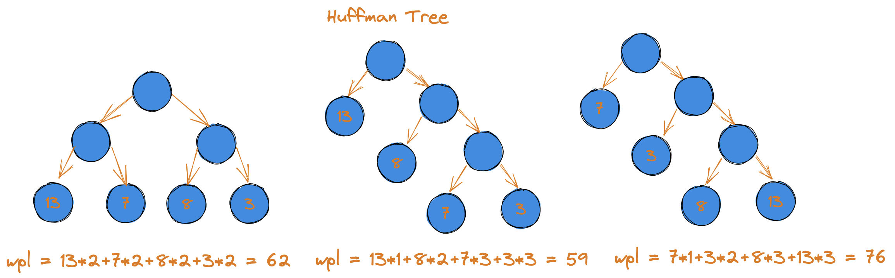
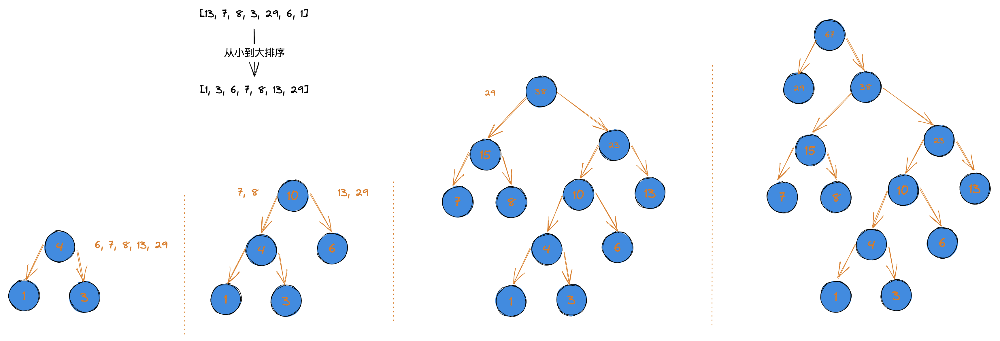
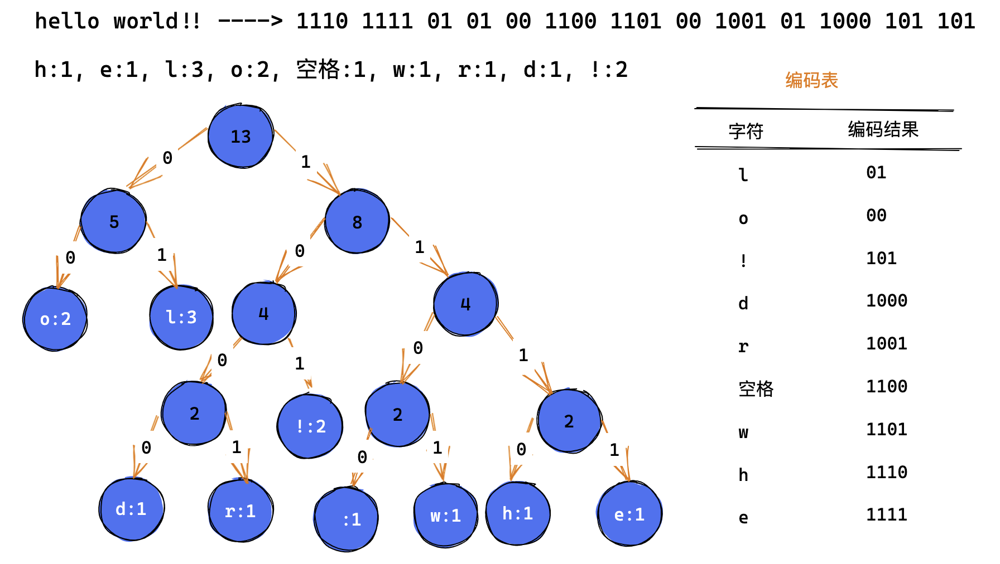
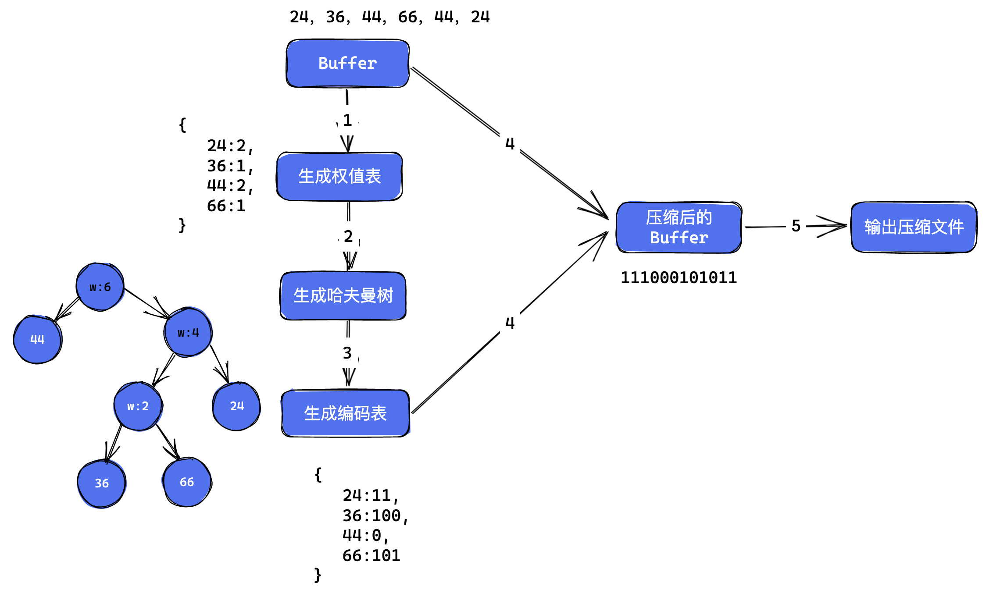
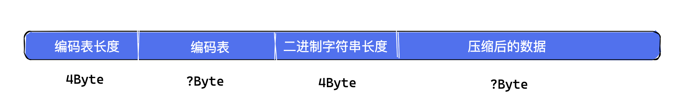

## 哈夫曼树

### 定义

1. 给定 n 个权值作为 n 个叶子结点，构造一棵二叉树，若该树的**带权路径长度**(WPL)达到最小，称这样的二叉树为 **最优二叉树**，也称为 **哈夫曼树**。
2. 哈夫曼树是带权路径长度最短的树，权值较大的结点离根结点较近。

3. **树的带权路径长度**：树的带权路径长度规定为所有**叶子结点**的带权路径长度（WPL，weighted path length）之和，权值越大的结点离根结点越近的二叉树才是最优二叉树。
4. WPL 最小的就是哈夫曼树。



### 场景

给定一个数字类型的数组，生成一棵哈夫曼树。

步骤：

1. 将数组从小到大进行排序，将每条数据生成一个树结点；
2. 取出根结点权值最小的两棵二叉树组成一棵新的二叉树；
3. 新的二叉树的根结点的权值是前两棵二叉树根结点权值的和；
4. 再将这棵新的二叉树，以根结点的权值大小再次进行排序，不断重复 1-2-3-4 的步骤，直到数列中所有的数据都被处理完，就得到了一棵哈夫曼树。

  

实现：

```ts
/** 输入 number[]，生成哈夫曼树 */
class HuffmanTree {
    tree: TreeNode;
    constructor(numArr: Array<number>) {
        this.tree = this.createHuffmanTree(numArr.slice());
    }

    public preOrder () {
        this.tree.preOrder(this.tree, (node) => {
            console.log('pre node ==> ', 
                { value: node.value, left: node.left?.value, right: node.right?.value }
            );
        });
    }

    /** 生成树 */
    public createHuffmanTree(numArr: Array<number>) {
        let nodeList = numArr.map((item) => {
            return new TreeNode(item);
        });

        while(nodeList.length > 1) {
            /** 先做一下排序，从小到大 */
            nodeList.sort((curNode, nextNode) => curNode.value - nextNode.value);

            const leftNode = nodeList[0];
            const rightNode = nodeList[1];

            const parent = new TreeNode(leftNode.value + rightNode.value);
            parent.left = leftNode;
            parent.right = rightNode;
            nodeList = [parent, ...nodeList.slice(2)];
        }
        return nodeList[0];
    }
}

/** 结点 */
class TreeNode {
    left: TreeNode | null;
    right: TreeNode | null;
    constructor (public value: number) {
        this.left = null;
        this.right = null;
    }

    /** 前序遍历 */
    public preOrder (node: TreeNode, callback: (node: TreeNode) => void) {
        if (node) {
            callback(node);
            this.preOrder(node.left as TreeNode, callback);
            this.preOrder(node.right as TreeNode, callback);
        }
    }
}   

const nums = [13, 7, 8, 3, 29, 6, 1];
const huffmanTree = new HuffmanTree(nums);
/** 前序遍历 */
huffmanTree.preOrder();
```

## 哈夫曼编码

哈夫曼编码哈夫曼树在电信通信中的经典应用之一，被广泛用于数据文件压缩，其压缩率通常在 20%~90% 之间，且是一种无损压缩，哈夫曼编码是**可变字节编码**（VLC）的一种，由 Huffman 于1952年提出的一种编码方法。

以字符串 `hello world!!` 为例，哈夫曼编码的流程如下：

1. 统计各个字符对应的个数；
2. 按照字符出现的次数构建一棵哈夫曼树，字符出现次数作为**权值**；
3. 根据哈夫曼树，生成编码，规定：树中向左的路径为0，向右的路径为1；



哈夫曼编码在解码时不会出现“多异性”，比如上图中在解码时要匹配到字符 `l` 时其他的编码的前缀是不包含字符 `l` 的编码的，同样别的字符也是如此，这在解码时就很容易去还原出原始数据。

### 编码实现

首先要改造一下前面的 huffmanTree 的实现，在原来的 TreeNode 类基础上增加一个新的属性：

```ts
class TreeNode<T = any> {
    left: TreeNode | null;
    right: TreeNode | null;
    /** 存放的数据 */
    data: T;
    /** 权值，就是之前的 value 属性 */
    weight: number;
}
```

然后通过一个 `list` 去创建出对应的哈夫曼树。

接着是盖章 HuffmanTree 的代码，它接收一个要压缩的文本字符串，收到字符串后：

1. 统计字符串中字符的出现次数（统计权值），可以使用一个 Map 存一下这个统计结果，key 是字符串或者该字符串对应的 Unicode 码，value 就是权值；
2. 根据生成的权值表构建哈夫曼树。

代码如下：

```ts
export class HuffmanCode {
    public readonly tree: TreeNode<number>;

    /** 编码表 */
    public readonly codeTable = new Map<number, string>();

    /** 要压缩的文本 */
    constructor(str: string) {
        /** 统计文本次数 */
        const charMap = this.statisticChar(str);
        this.tree = this.createHuffmanTree(charMap);
    }

    public statisticChar(str: string) {
        /** key 是字符对应的 Unicode 码，value 是权值 */
        const charMap = new Map<number, number>();
        for (let i = 0, len = str.length; i < len; i ++) {
            const unicode = str[i].charCodeAt(0);
            const count = charMap.get(unicode);
            charMap.set(unicode, count ? count + 1 : 1);
        }
        return charMap;
    }

    /** 生成 Huffman 树 */
    public createHuffmanTree(charMap: Map<number, number>) {
        let nodeList: TreeNode<number>[] = [];
        charMap.forEach((value, key) => {
            nodeList.push(new TreeNode(value, key));
        });

        while(nodeList.length > 1) {
            /** 先做一下排序，从小到大 */
            nodeList.sort((curNode, nextNode) => curNode.weight - nextNode.weight);

            const leftNode = nodeList[0];
            const rightNode = nodeList[1];
            /** 父结点不没有 data */
            const parent = new TreeNode(leftNode.weight + rightNode.weight);
            parent.left = leftNode;
            parent.right = rightNode;
            nodeList = [parent, ...nodeList.slice(2)];
        }
        return nodeList[0];
    }
}
```

生成哈夫曼树后，接着就是根据这棵树生成对应的编码表，这个编码表也可以使用一个 Map 去存，key 是统计的字符或者其 Unicode 码，value 就是二进制编码字符串。代码如下：

```ts
type Bit = '0' | '1';

/** 拿到编码表，一个 Map 类型，key 是 Unicode，value 是二进制码 */
private getCodes(node: TreeNode<number> | null, code: Bit | '' = '', codeBuilder = '') {
    if (node) {
        codeBuilder += code;
        if (node.data === null) {
            this.getCodes(node.left, '0', codeBuilder);
            this.getCodes(node.right, '1', codeBuilder);
        } else {
            this.codeTable.set(node.data, codeBuilder);
        }
    }
}
```

上面代码中 `getCodes` 函数的第一个参数就是我们生成的哈夫曼树根结点，`codeBuilder` 会累计二进制码，最终保存到 `codeTable` 这个类属性里。

最后是压缩算法，过程如下：

1. 遍历原始的文本数据，根据 codeTable 生成二进制字符串；
2. 把生成的二进制字符串转成 Byte Array 存储；

代码如下：

```ts
/**
 * 压缩函数
 * @param contentBytes 原始的文本数据
 * @param huffmanBytes 编码表
*/
private zip (content: string, huffmanBytes: Map<number, string>) {
    let byteStr = '';
    for (let s of content) {
        /* 根据 Unicode 从编码表中找出对应的二进制字符串 */
        const code = huffmanBytes.get(s.charCodeAt(0));
        code && (byteStr += code);
    }
    const huffmanBytesLen = byteStr.length;
    /* 计算出字节长度，1Byte = 8Bit */
    const len = Math.ceil(huffmanBytesLen / 8);
    /** 生成二进制补码 8 位有符号整数的数组 */
    const int8Arr = new Int8Array(len);
    let index = 0;
    for (let i = 0; i < huffmanBytesLen; i += 8) {
        const str = byteStr.slice(i, i + 8);
        int8Arr[index] = parseInt(str, 2);
        index += 1;
    }
    return int8Arr;
}
```

最后可以使用 Node.js 中的 `fs` 模块读取一个文本文件，然后使用上面算法压缩：  

```ts
const text = readFileSync('./HuffmanTree.js').toString();

const huff = new HuffmanCode(text);

fs.writeFileSync('./HuffmanTree.zip', huff.zip(text, huff.codeTable));
```

如果是在浏览器中，可以先读取 `File` 中的数据，然后进行压缩：

```ts
file.text().then((text) => {
    const huff = new HuffmanCode(text);
    const int8Arr = huff.zip(text, huff.codeTable);

    const newFile = new File([int8Arr], 'index.zip', {
        type: 'application/zip',
    });
    /* 生成下载链接 */
    const downloadUrl = URL.createObjectURL(newFile);
});
```

## 压缩文件

上面已经介绍了哈夫曼编码的基本原理，下面做个具体例子，实现一个 `compress` 方法，这个方法接收一个文件路径和输出后的 zip 包路径，经过 `compress` 方法处理后会输出 zip 压缩文件。

```ts
type compress = (input: string, output: string): void;
```

步骤：



1. 读取文件的 buffer 数据，代码如下：

```ts
// Node.js
import { promisify } from 'node:util';
const writeFile = promisify(fs.writeFile);
/** 如果文件不存在 */
const fileStat = fs.statSync(input);
const outputPath = output || input.replace(/\.\w+$/, '.zip');
if (!fileStat.isFile())  {
    return console.error(`没有找到'${input}'文件`);
}
readFile(input).then(buffer => {
    /* 拿到编码表 */
    const codingTable = this.init(buffer);
    /** 进行编码 */
    const compressedBuf = this.encode(buffer, codingTable);
    /** 输出文件，需要注意是：需要把编码表也存到文件中 */
    this.emitZipFile(compressedBuf, codingTable, outputPath);
});
```

2. `init` 函数接收原始的 buffer 数据，然后计各个字节的个数并生成权值表，根据字节权值表生成哈夫曼树，再根据哈夫曼树生成编码表。

```ts
private init(buffer: Buffer) {
    /** 生成权值表 */
    this.byteNumMap = this.statisticNum(buffer);
    /** 根据字节权值表生成哈夫曼编码 */
    this.huffmanTree = this.createHuffmanTree(this.byteNumMap);
    /** 生成编码表 */
    this.codingTable = this.getCodingTable(this.huffmanTree);
    return this.codingTable;
}
```

### 生成权值表

生成权值表比较简单，过程就是遍历 buffer，统计各个字节出现的个数，代码如下：

```ts
public statisticNum(buffer: Buffer) {
    const map = new Map<number, number>();
    buffer.forEach((byte) => {
        const count = map.get(byte) || 0;
        map.set(byte, count + 1);
    });
    return map;
}
```

### 生成哈夫曼树

根据上面的权值表生成哈夫曼树，叶子节点存储字节数据和对应的权值。

```ts
/** 权值从大到小排序，取的时候用 pop 取（先取最小的） */
public sort(nodeArray: TreeNode[]) {
    return nodeArray.sort((cur, next) => next.weight - cur.weight);
}

public createHuffmanTree(byteNumMap: Map<number, number>) {
    const nodeArray: TreeNode[] = [];
    for (let [byte, weight] of byteNumMap) {
        nodeArray.push(new TreeNode(weight, byte));
    }
    /** 开始生成哈夫曼树 */
    return this._createHuffmanTree(nodeArray);
}

private _createHuffmanTree(nodeArr: TreeNode[]) {
    while(nodeArr.length > 1) {
        /** 先从小到大排序 */
        this.sort(nodeArr);
        /** 节点权值两两相加，生成父节点 */
        const node1 = nodeArr.pop() as TreeNode;
        const node2 = nodeArr.pop() as TreeNode;
        /** 父节点没有内容，只有权值 */
        const parentNode = new TreeNode(node1.weight + node2.weight);
        parentNode.left = node1;
        parentNode.right = node2;
        nodeArr.push(parentNode);
    }
    return nodeArr[0];
}
```

### 根据哈夫曼树生成编码表

```ts
type Bit = '0' | '1';

private _getCodingTable(node: TreeNode | null, bit: Bit | '', strBuilder = '', table: Map<number, string>) {
    if (node) {
        /** 把传入的 code 拼接成字符串 */
        strBuilder += bit;
        /** 如果是非叶子节点就继续遍历（叶子节点都是有值的节点） */
        if (node.data === null) {
            this._getCodingTable(node.left, '0', strBuilder, table);
            this._getCodingTable(node.right, '1', strBuilder, table);
        } else {
            /** 当是叶子节点时，就把收集到的 strBuilder 放入 table 中 */
            table.set(node.data, strBuilder);
        }
    }
}

/** 生成编码表（key 是树节点的 value，value 是编码结果），根据哈夫曼树 */
public getCodingTable(huffmanTree: TreeNode) {
    const map = new Map<number, string>();
    this._getCodingTable(huffmanTree.left, '0', "", map);
    this._getCodingTable(huffmanTree.right, '1', "", map);
    return map;
}
```

### 编码

编码过程就是遍历原始的 buffer 数据，把 buffer 中的每个 byte 换成编码表里的二进制字符串，然后再把二进制字符串转成新的 byte，生成新的 buffer 数据。

```ts
public encode(buffer: Buffer, codingTable: Map<number, string>) {
    /** 1. 遍历原始的 buffer，从编码表里取出相应的码值，拼装成2进制字符串 */
    let binaryStr = '';
    buffer.forEach(byte => {
        binaryStr += codingTable.get(byte);
    });
    /** 2. 把 binaryStr 转成二进制流 */
    const binStrLen = binaryStr.length;
    /** 更新编码长度 */
    this.bitString = binaryStr;
    /** 计算出有多少个字节（1byte = 8bit），需要向上去整，因为 binaryStr 可能不是 8 的倍数 */
    const byteSize = Math.ceil(binStrLen / 8);
    const buf = Buffer.alloc(byteSize);
    /** 把生成的 binaryStr 每八位放入数组中 */
    let idx = 0;
    for (let i = 0; i < binStrLen; i += 8) {
        const byte = binaryStr.slice(i, i + 8);
        buf[idx] = Number(`0b${byte}`);
        idx += 1;
    }
    return buf;
}
```

### 输出文件

压缩文件需要包含一下信息：

1. 编码表，用户后续解码使用；
2. 压缩后的 buffer 数据；
3. 生成的二进制字符串长度（上面代码中的 `binaryStr.length`），这是为了解决最后一个二进制字符串转成 byte 时可能不足 8 位，解码时需要计算一下需要删除前面补的 `0`；

除了存储压缩后的 buffer，在一个文件中要存一些文件信息数据，这就需要约定一下数据流的格式。

1. 首先是前四个字节用于存储编码表的长度；
2. 四个字节之后存储编码表；
3. 编码表之后的四个字节存储压缩后的二进制字符串的长度；
4. 最后存储压缩后的二进制数据；



使用 4Byte 存储长度值时可以使用 Node.js 中的 `writeUint32BE` API，写入一个 32Bit 长度的数字，可以表示的最大数值是 `2^32 - 1`，转换成存储大小则是 `4GB`，即压缩后的数据大小需要小于 4GB，不然长度值会溢出，导致解压时出现异常。与 `writeUint32BE` 对应的则是 `readUint32BE` 用户读取数值。

输出文件整体代码如下：

```ts
private emitZipFile(compressedBuf: Buffer, codingTable: Map<number, string>, output: string) {
    /** 使用 stream 存储 */
    const writeStream = fs.createWriteStream(output, { encoding: 'binary' });
    writeStream.on('error', (err) => {
        console.error(`压缩出现异常：${err}`);
    });

    const charMap = new Map<string, string>();
    codingTable.forEach((val, key) => {
        const char = String.fromCharCode(key);
        charMap.set(char, val);
    });

    /** 把 map 转成 JSON */
    const json = this.mapToJson(codingTable);

    const jsonBuf = Buffer.from(json);
    /** 在首部用 32 位存储压缩表的大小 */
    const jsonLenBuf = Buffer.alloc(4);
    jsonLenBuf.writeUint32BE(jsonBuf.length);
    /* 写入 json 数据 */
    writeStream.write(jsonLenBuf);
    writeStream.write(jsonBuf);
    /** 把字节长度写进去，申请一个 32 位长度的空间（4字节） */
    const bitSizeBuf = Buffer.alloc(4);
    bitSizeBuf.writeUInt32BE(this.bitString.length);
    writeStream.write(bitSizeBuf);
    writeStream.end(Buffer.from(compressedBuf));
}
```

## 解压

解压过程与压缩相反：

1. 读取压缩文件 buffer 数据；
2. 取出各个数据块（编码表、长度、数据）；
3. 根据编码表生成解码表（编码表的 key 和 value 调换位置即可）；
4. 把二进制数据转成二进制字符串，后边遍历字符串匹配解码表对应的 byte 值；
5. 把遍历出来的所有的 byte 组装成 buffer，就得到了原始数据；
6. 最后输出文件；

代码如下：

```ts
/** 解压 */
decompress(input: string, output: string) {
    const fileStat = fs.statSync(input);
    if (!fileStat.isFile()) {
        return console.error(`没有找到'${input}'文件`);
    }
    /**
     * 实现解压：
     * 读取压缩文件流 --> 拿到编码 --> 生成解码表 --> 拿到数据流 --> 还原 
    */
    const readStream = fs.createReadStream(input);
    readStream.on('error', (err) => {
        console.error(`解压出现异常：${err}`);
    });

    const chunks: Buffer[] = [];
    let totalLength = 0;

    readStream.on('data', (chunk) => {
        const buffer = chunk as Buffer;
        chunks.push(buffer);
        totalLength += buffer.length;
    });

    readStream.on('end', () => {
        const buffer = Buffer.concat(chunks);   // 合并所有的 chunk
        /** 首先从前四位取出编码表的长度 */
        const encodingTableBufSize = buffer.readUint32BE(0);
        /** 再接取出编码表，subarray 等同于 slice，slice API 已弃用 */
        const endIdx = encodingTableBufSize + 4;
        const encodingTableBuf = buffer.subarray(4, endIdx);
        /** 然后取出编码字符串长度 */
        const bitSizeBuf = buffer.subarray(endIdx, endIdx + 4);
        /** 最后取出压缩数据 */
        const zipBinary = buffer.subarray(endIdx + 4);

        const codingTableJson = encodingTableBuf.toString();
        const bitLength = (bitSizeBuf as Buffer).readUint32BE(0);
        try {
            const decodingTable = this.createDecodingTable(JSON.parse(codingTableJson.toString()));
            const buffer = this.getOriginBuffer(decodingTable, zipBinary as Buffer, bitLength);
            this.emitOriginFile(buffer, output);
        } catch (error) {
            return console.error(`解压失败：${error}`);
        }
    });
}
```

上面代码中 `getOriginBuffer` 是核心，它根据解码表、压缩数据和原始的压缩后的二进制字符串长度还原出原始的数据。

```ts
public getByteStr = (num: number) => {
    const bit = num.toString(2);
    const { length } = bit;
    if (length === 8)   return bit;
    return new Array(8 - length).fill(0).join('').concat(bit);
}

/** 根据解码表和压缩后的数据生成原始数据 */
public getOriginBuffer(decodingTable: Map<string, number>, buffer: Buffer, bitLength: number) {
    let binaryStr = '';
    const lastIdx = buffer.length - 1;
    /** 首先需要把 buffer 转成二进制字符串 */
    buffer.forEach((num, idx) => {
        const byte = this.getByteStr(num);
        if (idx !== lastIdx) {
            binaryStr += byte;
        } else {        
            // 最后一位需要检查有没有向前填充 0，因为 bitLength 可能不是 8 的倍数
            /** 生成源文件的 buffer，需要注意的是：最后一个 byte 可能不是 8 位 */
            let lastByteStr = byte;
            const redundant = Math.abs(bitLength - binaryStr.length - lastByteStr.length);
            lastByteStr = lastByteStr.slice(redundant);
            binaryStr += lastByteStr;
        }
    });
    let bitStr = '';
    const nums: number[] = [];
    for (let i = 0, len = binaryStr.length; i < len; i ++) {
        bitStr += binaryStr[i];
        /* 从解码表中获取 byte 数据 */
        const value = decodingTable.get(bitStr);
        if (typeof value === 'number') {
            bitStr = '';
            nums.push(value);
        }
    }
    const finalBuf = Buffer.alloc(nums.length);
    finalBuf.set(nums);
    return finalBuf;
}
```
