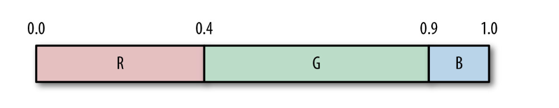
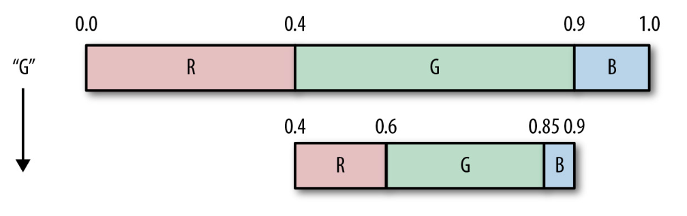
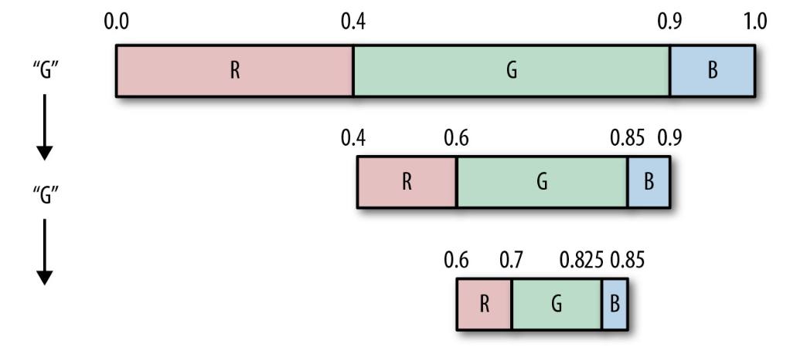
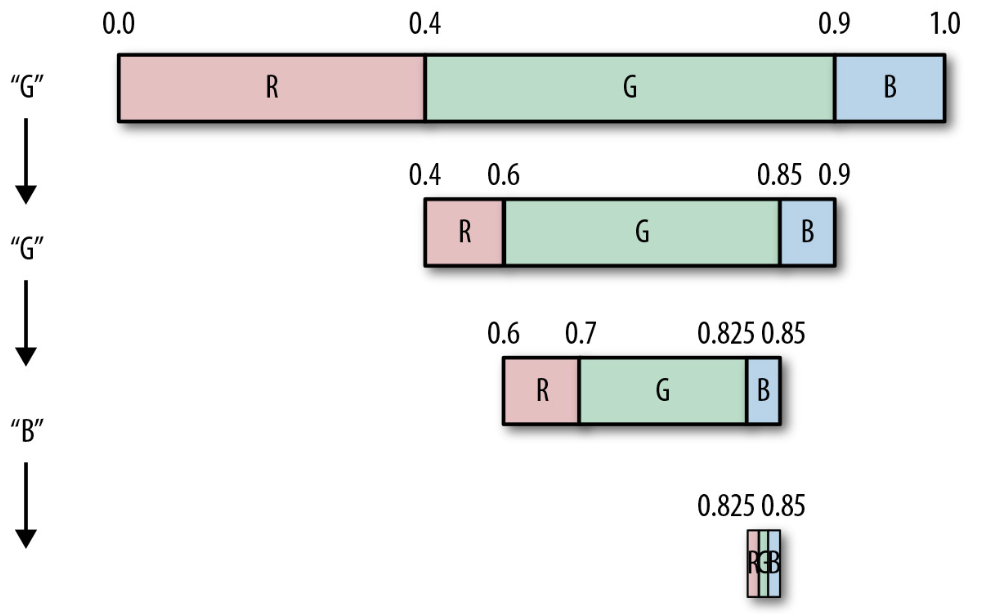
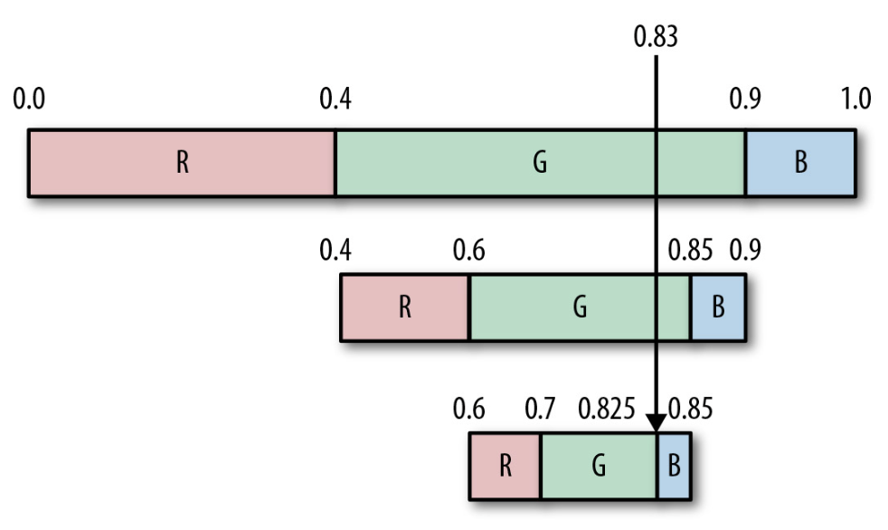
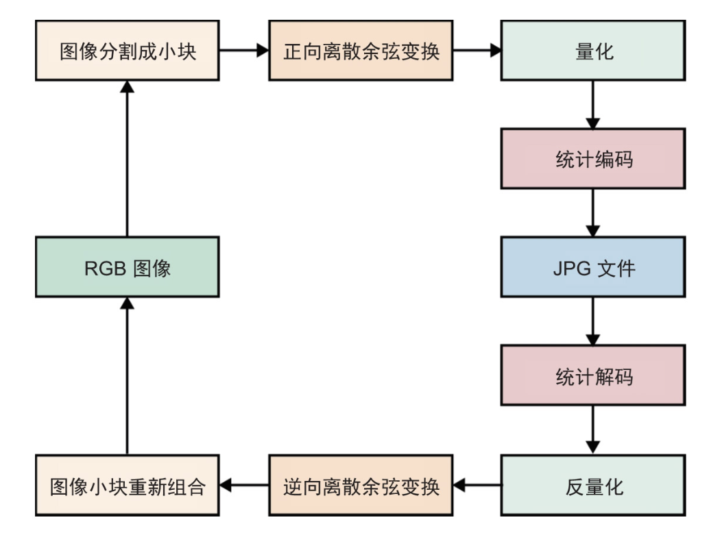
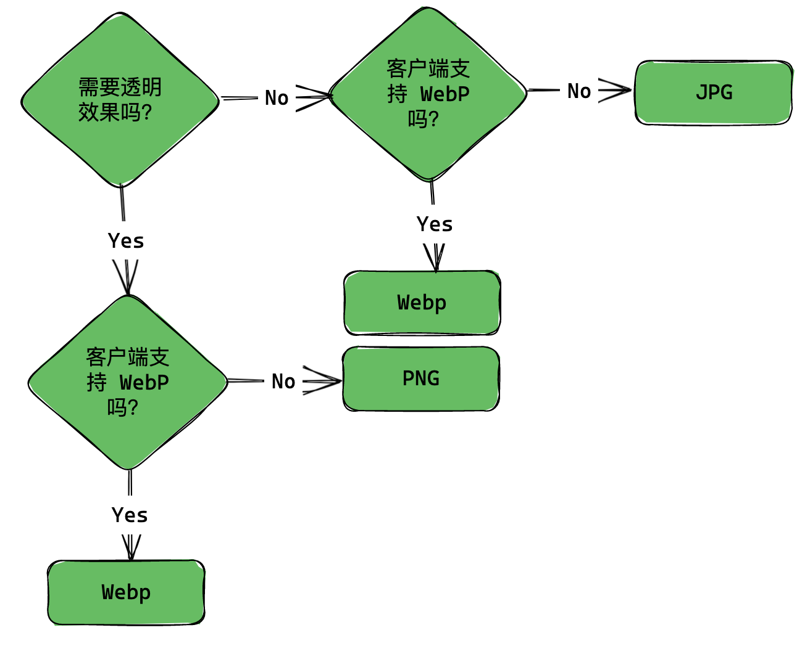

# 数据压缩入门

## 信息论

将一个变量对应的 `LOG2` 函数的值定义为它的熵（entropy），也就是用二进制来表示这个数所需的最少二进制位数。

比如如果把字符串 `abcd` 用二进制表示，则最少需要两个二进制位数表示（$log_24=2$）

|字符|码字|
|:----|:----|
|a|00|
|b|01|
|c|10|
|d|11|

而对于有重复字符的数据，例如 G=\[A, B, B, C, C, C, D, D, D, D]，需要使用以下公式计算熵：

$y = -\sum_{i=1}^{n}{p_i}{log_2}({p_i})$

$p_i$ 表示各个字符的概率，计算过程就是用改字符数量除以总的数据长度。

$P(v_i) = \frac{count(v_i)}{len(G)}$

|字符|概率|$p_i \times log_2{p_i}$|
|:----|:----|:----|
|A|0.1|-0.3321|
|B|0.2|-0.4642|
|C|0.3|-0.5208|
|D|0.4|-0.5284|
| |总和|-1.8455|

对最后一列求和，得到 `–1.8455`（允许有些小误差）。求熵公式的最前面还有一个负号（即求和符号∑前面的那个负号），因此得出结论：表示这组数据每个符号平均约需要 1.8455 个二进制位。所以我们可以大致认为平均每个值用 2 个二进制位（通过向上取整运算获得）就可以对 `G` 进行编码。

> 为了使表示某个数据集所需的二进制位数最少，数据集中的每个符号平均所需的最小二进制位数就是熵。  
> 
> 一个符号出现得越频繁，它对整个数据集包含的信息内容的贡献就会越少。

### 信息论与数据压缩

数据压缩算法的艺术，就在于真正试图去突破熵的限定，或者说是将数据转换成一种熵值更小的、新的表现形式。怎样应用数据转换以创造熵更小的数据流（然后再用适当的方法进行压缩）。

例如一个元素递增集合：$A=[0,1,2,3,4,5,6,7]$，通过计算熵发现我们至少需要 3 个二进制位才能表示出所有的数字（$log_28 = 3$），不过该集合是有规律的，相邻元素间的差值是 1，如果将各个数编码为其与前一个数的差，则会变成这样一个集合：$[0,1,1,1,1,1,1,1]$，这一数据流的熵 $H(A) = 1$。

又比如假定你遇到了字符串 $S=TOBEORNOTTOBEORTOBEORNOT$，它包含了不同符号的集合 $[O,T,B,E,R,N]$，而熵 $H(s) = 2.38$。

任何人看一眼这个字符串，都能意识到其中含有重复的单词。因此，如果不是将单个的字母当成符号，而是把单词当成符号，情况又会如何呢？这样一来，我们有单词集合 $[TO,BE,OR,NOT]$，其熵 $H(S) = 1.98$。

## VLC（变长编码，variable-length codes）

一般来说，对数据进行 `VLC` 通常有3个步骤：
1. 遍历数据集中的所有符号并计算每个符号的出现概率；
2. 根据概率为每个符号分配码字，一个符号出现的概率越大，所分配的码字就越短；
3. 再次遍历数据集，对每一个符号进行编码，并将对应的码字输出到压缩后的数据流中；

例如字符串 $S=TOBEORNOTTOBEORTOBEORNOT$，根据 VLC 步骤就可以得到以下编码表：
|字符|频数|码字|
|:----|:----|:----|
|O|8|11|
|T|5|00|
|B|3|011|
|E|3|101|
|R|3|0100|
|N|2|0101|

要使用刚创建的符号码字对应表对“TOBEORNOT”进行编码，最终得到对应的输出流为001101110111010001011100，共24个二进制位。

解码时遍历二进制流，匹配编码表输出对应的字符。

不过需要注意的是，给字符分配二进制位时需要避免“竞争”，例如如果给 `O` 分配了`01`就会和 `E` 的编码`011`竞争，解码时读完`01`后无法判断是输出`O`还是往后继续匹配。  

因此，选择正确的 VLC 方法并赋给每个符号正确的码字，是一项挑战。在设计 VLC 集的码字时，必须考虑两个原则：一是越频繁出现的符号，其对应的码字越短；二是码字需满足前缀性质（避免竞争）。

## 统计编码
这类算法通过数据集中符号的出现概率来确定新的、唯一的变长码字。最终的结果就是，给定任何输入数据，我们都能为其构造出一套自定义的码字集。

### 算数编码
算术编码首先会创建 $[0,1)$ 这样的数值区间，然后再通过数据流中符号出现的概率对这一区间进行细分。

假定有3个字符 R、G 和 B,其出现概率分别是 0.4、0.5 和 0.1。根据这3个字符的出现概率，我们在 $[0,1)$ 范围内为它们分配了相应的取值区间（表对应的熵值为 `1.36`），如下表所示：

|符号|概率|取值区间|
|:----|:----|:----|
|R|0.4|$[0, 0.4)$|
|G|0.5|$[0.4, 0.9)$|
|B|0.1|$[0.9, 1)$|

  

使用这样的概率设定，对字符串“GGB”编码。

从输入流中读到的第一个字符为 G，根据上表可以知道 G 的取值区间为 $[0.4,0.9)$。因此，需要按 3 个字符的出现概率对 $[0.4,0.9)$ 这一区间进行再次细分，得到 3 个符号的新取值区间，如下图及下表所示。



|符号|概率|更新后的取值区间|
|:----|:----|:----|
|R|0.4|$[0.4, 0.6)$|
|G|0.5|$[0.6, 0.85)$|
|B|0.1|$[0.85, 0.9)$|

接着从输入流中读取第二个字符，还是 G，因此需要继续细分G的取值区间，此时其范围为 `0.6~0.85`，并再次根据概率更新各个符号的取值区间。

  

读取第三个字符B，再次细分其取值区间，并更新相应的图和表。

  

|符号|概率|更新后的取值区间|
|:----|:----|:----|
|R|0.4|$[0.825, 0.835)$|
|G|0.5|$[0.835, 0.8475)$|
|B|0.1|$[0.8475, 0.85)$|

细分完了取值区间后需要选定一个正确的输出值，B的最终取值区间是 $[0.825,0.85)$，在此区间内的任何数值都能让我们重新构建出原来的字符串，因此可以从中任取一值。  

这里取 `0.83` 这个小数作为输出（或者转成 83 整数，则只需 $log_283\approx2.33$ 个二进制位），这样就能看出它落在哪个区间内，然后再将与此区间相关联的符号输出。

#### 解码

1. 拿到原始的取值范围表，和 `0.83` 输出值；
2. 发现 0.83 在 G 的取值区间内，则输出字符 `G`；
3. 然后对 G 区间进行细分，发现 0.83 还是落到 G 区间内，再输出 `G`；
4. 然后再对 G 区间进行细分，发现 0.83 落到了 B 区间，最后输出 `B`；



## 数据压缩使用场景

PNG、JPG、GIF 和 WebP 图片格式如何选择？

- PNG：无损压缩格式，支持透明度，允许文件中存在元数据块，可以将额外的数据附加到文件中（通常它也是数据膨胀的主要原因），对于复杂的图像不会包含很多颜色相似的像素，因此压缩就会不太理想；
- JPG：有损压缩，不支持透明度，可以通过一个质量值来控制它，以达成对文件大小与图像质量的权衡取舍。JPG 这种压缩格式的基础是分块编码，一幅图像会被分成8×8的小块，然后在每块上应用各种不同的变换，再将变换之后的小块组合起来交给统计编码算法处理。
  
  - 
  
- GIF：支持透明度的格式，此外它还支持动画，GIF 格式文件的生成包含两个压缩步骤，第一步是有损的色彩数量压缩，将整个图像的颜色数量减少到只有 `256` 种，第二步则是无损的 LZW 压缩。将图像颜色的数量减少到256种会极大地降低图像的质量，而好处则是文件压缩得更小。
- WebP：提供了介于 PNG 和 JPG 之间的中间地带。WebP既支持无损模式和透明度，同时也支持有损模式。但浏览器不是 100% 支持它，除此之外，在有损压缩模式下的高压缩率，也就意味着在解压时它要比 JPG 或者 PNG 格式慢一些。  



在浏览器中则可以利用 canvas API 中的 `toDataURL` API 将画布转成 base64 格式的图片，默认是 `PNG` 的图像。

```js
canvas.toDataURL(type, quality);
```

- type: 图片格式，默认为 image/png；
- quality: 在指定图片格式为 image/jpeg 或 image/webp 的情况下，可以从 0 到 1 的区间内选择图片的质量。如果超出取值范围，将会使用默认值 0.92。

还可以使用 `toBlob` API 创造 Blob 对象，用以展示 canvas 上的图片。

```js
toBlob(callback, type, quality);
```
回调函数可获得一个单独的 Blob 对象参数。

图片处理相关库：

- [compressorjs](https://github.com/fengyuanchen/compressorjs) 前端图片压缩库；
- [terser](https://github.com/terser/terser) JavaScript 解析器、变形器和压缩器工具包；
- [UglifyJS](https://github.com/mishoo/UglifyJS) JavaScript 解析器、压缩器和美化器工具包；
- [terser-webpack-plugin](https://github.com/webpack-contrib/terser-webpack-plugin) webpack 代码压缩插件；
- [cssnano](https://github.com/cssnano/cssnano) CSS 压缩器；
- [compression](https://github.com/expressjs/compression) Node.js 压缩中间件；

### HTTP 协议中的数据压缩

参考：

- [MDN: HTTP 协议中的数据压缩](https://developer.mozilla.org/zh-CN/docs/Web/HTTP/Compression)

- [CSDN: HTTP请求的响应头部Vary的理解](https://blog.csdn.net/qq_29405933/article/details/84315254)

- [Nginx: Module ngx_http_gzip_module](https://nginx.org/en/docs/http/ngx_http_gzip_module.html)

- [MDN: Accept-Encoding](https://developer.mozilla.org/zh-CN/docs/Web/HTTP/Headers/Accept-Encoding)  

### 前端打包优化

在前端代码生产环境打包时，可以采用以下优化措施：

1. 代码压缩：通过使用代码压缩工具（如UglifyJS、TerserJS），可以删除多余的空格、注释和不必要的代码，从而减小文件大小；

2. 文件合并：将多个小文件合并成一个大文件，比如讲小图片转成 base64，可以减少 HTTP 请求的次数，提高页面加载速度；

3. 图片压缩：将图片压缩到合适的大小，可以减小文件大小，提高页面加载速度；

4. CDN加速：将静态资源（如CSS、JS、图片等）放在 CDN 上，可以提高页面加载速度，减少服务器负载；

5. 懒加载：对于一些不必要的资源（如图片、音频、视频等），可以使用懒加载技术，当用户滚动到该资源所在的位置时再进行加载，从而提高页面加载速度；

6. 缓存优化：使用浏览器缓存和 HTTP 缓存，可以减少服务器负载和提高页面加载速度；

7. Tree Shaking：可以通过在打包时使用 Tree Shaking技术，删除未使用的代码，从而减少文件大小；

8. Code Splitting：通过将代码拆分成多个小模块，可以提高页面加载速度；

9. 服务端渲染（SSR）：对于一些需要 SEO 的页面，可以使用SSR技术，将页面的HTML代码在服务器端生成，从而提高页面的搜索排名和加载速度；
